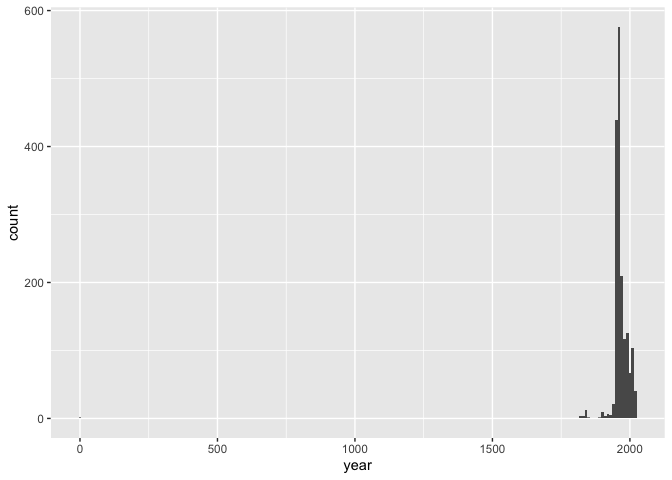

Lab 08 - University of Edinburgh Art Collection
================
Holland Sun
2026 Feb

## Load Packages and Data

First, let’s load the necessary packages:

``` r
library(tidyverse) 
```

    ## Warning: package 'readr' was built under R version 4.4.3

``` r
library(skimr)
```

    ## Warning: package 'skimr' was built under R version 4.4.3

Now, load the dataset. If your data isn’t ready yet, you can leave
`eval = FALSE` for now and update it when needed.

``` r
# Remove eval = FALSE or set it to TRUE once data is ready to be loaded
uoe_art <- read_csv("data/uoe-art.csv")
```

## Exercise 1-4

Foe example, If I click the link, the URL is:

`https://collections.ed.ac.uk/art/record/99422?highlight=*:*`

What we scraped is: `./record/99422?highlight=*:*"`

we need to replace the `.` with `https://collections.ed.ac.uk`

All other changes are saved in `01-scrap-page-one.R`

## Exercise 5 & 6

See `02-scrap-page-function.R`

``` r
source("scripts/02-scrape-page-function.R")
```

    ## 
    ## Attaching package: 'rvest'

    ## The following object is masked from 'package:readr':
    ## 
    ##     guess_encoding

``` r
first_url <- "https://collections.ed.ac.uk/art/search/*:*/Collection:%22edinburgh+college+of+art%7C%7C%7CEdinburgh+College+of+Art%22?offset=0"
scrape_page(first_url)
```

    ## # A tibble: 10 × 3
    ##    title                                                 artist            link 
    ##    <chr>                                                 <chr>             <chr>
    ##  1 Untitled - Abstract Building (1972)                   Lindsay R S Gord… ./re…
    ##  2 Study for Two Figure Composition (1949)               Douglas Baxter    ./re…
    ##  3 Self-Portrait (1967)                                  Gregor Smith      ./re…
    ##  4 Walking the Wall (Unknown)                            Victoria C F Ber… ./re…
    ##  5 Summer Composition 1967 (1967)                        Alan T. Johnston  ./re…
    ##  6 Untitled (Unknown)                                    Catherine Fairgr… ./re…
    ##  7 Untitled (1967)                                       Sam Rae           ./re…
    ##  8 Riders from South Frieze of the Parthenon (1836-1837) <NA>              ./re…
    ##  9 That's a Novel Concept (2007)                         Hannah Jasper     ./re…
    ## 10 Unknown (1947)                                        Vivien Chapman    ./re…

``` r
second_url <- "https://collections.ed.ac.uk/art/search/*:*/Collection:%22edinburgh+college+of+art%7C%7C%7CEdinburgh+College+of+Art%22?offset=10"
scrape_page(second_url)
```

    ## # A tibble: 10 × 3
    ##    title                                              artist               link 
    ##    <chr>                                              <chr>                <chr>
    ##  1 Study of Three Skeletons (Circa 1961)              William O. Little    ./re…
    ##  2 Bearded Goat (1920s)                               Emma Gillies         ./re…
    ##  3 Seated Male Nude                                   Graham Durward       ./re…
    ##  4 Reclining Female Nude on White Iron Bed            Unknown              ./re…
    ##  5 Step 4 (2013)                                      Maria Hadam          ./re…
    ##  6 Reclining Female Nude (1948)                       Victorine Anne Schi… ./re…
    ##  7 Study for picture 'Waking of Brynhildr' (1897)     Pavlov Chailly       ./re…
    ##  8 Espresso Cup (1920s)                               Emma Gillies         ./re…
    ##  9 Untitled (1983)                                    Robert Rivers        ./re…
    ## 10 Thurs 2nd Sept '82 Along from Rialto (02 Sep 1982) Moira A Edmondston   ./re…

## Exercise 7 8 9

See `03-scrap-page-many.R`

## Exercise 10

Let’s start working with the **title** column by separating the title
and the date:

``` r
uoe_art <- read_csv("data/uoe-art.csv")
```

    ## Rows: 3321 Columns: 3
    ## ── Column specification ────────────────────────────────────────────────────────
    ## Delimiter: ","
    ## chr (3): title, artist, link
    ## 
    ## ℹ Use `spec()` to retrieve the full column specification for this data.
    ## ℹ Specify the column types or set `show_col_types = FALSE` to quiet this message.

``` r
uoe_art <- uoe_art %>%
  separate(title, into = c("title", "date"), sep = "\\(") %>%
  mutate(year = str_remove(date, "\\)") %>% as.numeric()) %>%
  select(title, artist, year, link)  # 
```

    ## Warning: Expected 2 pieces. Additional pieces discarded in 58 rows [32, 67, 100, 111,
    ## 224, 270, 437, 645, 665, 727, 742, 771, 1024, 1053, 1058, 1082, 1092, 1166,
    ## 1287, 1311, ...].

    ## Warning: Expected 2 pieces. Missing pieces filled with `NA` in 599 rows [13, 14, 24, 28,
    ## 29, 31, 35, 40, 41, 45, 47, 50, 53, 54, 63, 70, 73, 91, 101, 103, ...].

    ## Warning: There was 1 warning in `mutate()`.
    ## ℹ In argument: `year = str_remove(date, "\\)") %>% as.numeric()`.
    ## Caused by warning in `str_remove(date, "\\)") %>% as.numeric()`:
    ## ! NAs introduced by coercion

When running the code, 3 warnings are produced.

The first warning tells us that 58 rows had more than one `(` in the
title, so separate() only split at the first `(`and discarded the extra
pieces.

The second warning tells us that 599 rows had no ( at all, so the date
column was filled with NA.

The third warning tells us that some values in the date column could not
be converted to numbers, so `as.numeric()` coerced them to NA.

We are ok with these warnings because our goal is simply to capture year
information where it is conveniently available. Entries that don’t have
a clean year in parentheses will just have NA for the year.

## Exercise 11

``` r
skim(uoe_art)
```

|                                                  |         |
|:-------------------------------------------------|:--------|
| Name                                             | uoe_art |
| Number of rows                                   | 3321    |
| Number of columns                                | 4       |
| \_\_\_\_\_\_\_\_\_\_\_\_\_\_\_\_\_\_\_\_\_\_\_   |         |
| Column type frequency:                           |         |
| character                                        | 3       |
| numeric                                          | 1       |
| \_\_\_\_\_\_\_\_\_\_\_\_\_\_\_\_\_\_\_\_\_\_\_\_ |         |
| Group variables                                  | None    |

Data summary

**Variable type: character**

| skim_variable | n_missing | complete_rate | min | max | empty | n_unique | whitespace |
|:--------------|----------:|--------------:|----:|----:|------:|---------:|-----------:|
| title         |         0 |          1.00 |   0 | 282 |     1 |     1635 |          0 |
| artist        |       108 |          0.97 |   2 |  55 |     0 |     1202 |          0 |
| link          |         0 |          1.00 |  26 |  29 |     0 |     3321 |          0 |

**Variable type: numeric**

| skim_variable | n_missing | complete_rate |    mean |   sd |  p0 |  p25 |  p50 |  p75 | p100 | hist  |
|:--------------|----------:|--------------:|--------:|-----:|----:|-----:|-----:|-----:|-----:|:------|
| year          |      1575 |          0.53 | 1964.75 | 53.1 |   2 | 1953 | 1962 | 1978 | 2024 | ▁▁▁▁▇ |

Based on the `skim()` output, `108` pieces have missing artist
information and `1575` pieces have missing year information.

## Exercise 12

``` r
ggplot(uoe_art, aes(x = year)) +
  geom_histogram(binwidth = 10)
```

    ## Warning: Removed 1575 rows containing non-finite outside the scale range
    ## (`stat_bin()`).

<!-- -->

There seems to be some(or one) outliers near 0，We can use arrange to
double check

``` r
uoe_art %>%
  filter(!is.na(year)) %>%
  arrange(year) %>%
  head(5)
```

    ## # A tibble: 5 × 4
    ##   title                    artist         year link                         
    ##   <chr>                    <chr>         <dbl> <chr>                        
    ## 1 "Death Mask "            H. Dempshall      2 ./record/21649?highlight=*:* 
    ## 2 "Mary Ann Park Sampler " Mary Ann Park  1819 ./record/102706?highlight=*:*
    ## 3 "Fine lawn collar "      Unknown        1820 ./record/102681?highlight=*:*
    ## 4 "Dying Gaul "            Unknown        1822 ./record/20597?highlight=*:* 
    ## 5 "The Dead Christ "       Unknown        1831 ./record/20573?highlight=*:*

It turned out that there was only one outlier. in year 2.

## Exercise 13

The outlier piece is “Death Mask (2) (1964)”. The correct year is 1964.
Our code failed to capture the correct year because the title contains
two sets of parentheses: “Death Mask (2) (1964)”. Since separate()
splits at the first (, it captured “2)” instead of “1964)”, so it lead
to year of 2 .

``` r
uoe_art <- uoe_art %>%
  mutate(year = if_else(year == 2, 1964, year))
ggplot(uoe_art, aes(x = year)) +
  geom_histogram(binwidth = 10)
```

    ## Warning: Removed 1575 rows containing non-finite outside the scale range
    ## (`stat_bin()`).

<!-- -->

It looks normal now. \## Exercise 14

``` r
uoe_art %>%
  count(artist, sort = TRUE) %>%
  head()
```

    ## # A tibble: 6 × 2
    ##   artist               n
    ##   <chr>            <int>
    ## 1 Unknown            371
    ## 2 Emma Gillies       175
    ## 3 <NA>               108
    ## 4 Ann F Ward          23
    ## 5 John Bellany        22
    ## 6 Zygmunt Bukowski    21

The most frequently featured artist is **“Unknown”**, who must be an
incredibly versatile figure. I’ve seen this master’s name across
multiple fields. The second most common is **“Emma Gillies”**, whom I
was not familiar with, but after checking Wikipedia, I found that she
was a Scottish ceramic artist who studied and worked at the Edinburgh
College of Art, so it makes sense that the university has a large
collection of her work. The third most featured artist, **“NA”** is
likely a master of programming and data processing who also dabbles in
art in their spare time and it is quite impressive as well. I’ve also
come across this name in these field.

## Exercise 15

``` r
childc <- uoe_art %>%
  filter(str_detect(title, regex("child", ignore_case = TRUE))) 
```

The word “child” appears `11` times in these titles.
